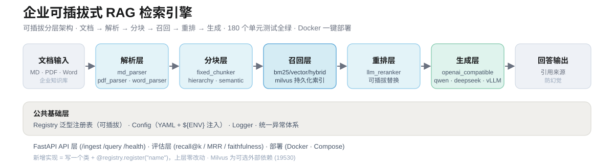

# 企业可插拔式 RAG 检索引擎



从零实现的**可插拔式企业 RAG 检索引擎**（AI 应用工程师方向作品集项目）。每层抽象 + 注册表 + 配置选型，新增实现只需写类加装饰器，上层零改动。

## 在线演示

无需安装即可在线体验核心流程（文档上传 → 分块 → 检索 → 来源溯源）：

[**▶ 打开在线演示**](https://devinhecoder.github.io/rag_engine/) · GitHub Pages 托管

支持：多文档上传、三种分块策略切换、混合检索、来源溯源展示、流式回答。

```
文档 → 解析(P1) → 分块(P2) → 召回(P3) → 重排(P4) → 生成(P4) → API(P5) → 评估(P6) → 部署(P7)
```

## 特性

- **可插拔分层架构**：文档解析 / 分块 / 召回 / 重排 / LLM 客户端 五层，均基于「抽象基类 + 注册表 + YAML 选型」
- **四种召回策略**：BM25 关键词召回、向量语义召回、Hybrid（RRF 融合）、Milvus 向量召回（服务端持久化索引）
- **三种分块策略**：Fixed（滑动窗口自然边界）、Hierarchy（标题层级）、Semantic（嵌入突变）
- **三种文档解析**：Markdown / PDF / Word
- **LLM 重排 + 生成**：OpenAI 兼容接口，一行切换 DeepSeek / 通义 / 豆包 / 本地 vLLM
- **企业级 Web UI**：深色侧栏单页应用，支持上传文档、切换分块策略 / 召回策略、清空知识库、清空对话
- **多租户 API Key**：Header 鉴权，按租户隔离索引与查询缓存
- **来源溯源**：每条回答附带来源文档片段与相关度分数
- **FastAPI 服务**：`/ingest`（文本/文件上传）、`/query`（端到端）、`/ingest/reset`（清空当前租户索引）、`/health`
- **离线评估**：recall@k / precision@k / MRR / hit@k + 可选 LLM 忠实度
- **180 个单元测试**，全链路闭环验证（Milvus 测试全量 mock，无需真实服务）

## 架构

```
┌─────────────────────────────────────────────────────────┐
│  Web UI        web/index.html (nginx 8080)              │
├─────────────────────────────────────────────────────────┤
│  API 层 (P5)   FastAPI / RAGService（依赖注入）           │
│  /ingest /query /ingest/reset /health /admin/keys       │
├─────────────────────────────────────────────────────────┤
│  评估层 (P6)   Evaluator（recall@k / MRR / faithfulness）│
├──────────────┬──────────────┬──────────────┬───────────┤
│  解析 (P1)   │  分块 (P2)   │  召回 (P3)   │ 重排 (P4) │
│  md/pdf/word │ fixed/hier/  │ bm25/vector/ │llm_rerank    │
│              │ semantic     │ hybrid/milvus │              │
├──────────────┴──────────────┴──────────────┴───────────┤
│  LLM 客户端 (P4)  OpenAI 兼容（DeepSeek/通义/豆包/vLLM）  │
├─────────────────────────────────────────────────────────┤
│  公共层 (P0)  Registry / Exceptions / Config / Logger    │
└─────────────────────────────────────────────────────────┘
   外部依赖: Milvus(19530) ← 可选，docker-compose.milvus.yml
```

**可插拔机制**：每层一个 `Registry[T]`（`src/common/registry.py`），实现类加 `@registry.register("name")` 装饰器即自动注册；`config/settings.yaml` 的 `name` 字段决定选型，支持 `RAG_*` 环境变量深路径覆盖。

## 目录结构

```
rag_engine/
├── src/
│   ├── common/          # P0: Registry / Exceptions / Constants
│   ├── utils/           # P0: config_loader（YAML+环境变量）/ logger
│   ├── document_parser/ # P1: md / pdf / word 解析器
│   ├── chunker/         # P2: fixed / hierarchy / semantic 分块器
│   ├── retriever/       # P3: bm25 / vector / hybrid / milvus 召回器
│   ├── llm_client/      # P4: OpenAI 兼容客户端
│   ├── reranker/        # P4: LLM 重排器
│   ├── evaluation/      # P6: 指标 / 数据集 / 忠实度 / 评估器
│   └── api/             # P5: FastAPI 应用 / 路由 / 服务层
├── config/              # settings.yaml / logging.yaml
├── examples/            # query_rag.py / evaluate.py / ingest_docs.py
├── tests/               # 180 个单元测试
├── web/                 # 企业级深色 Web UI + nginx 配置
├── landing/             # 演示落地页（含演示视频）
├── demo_doc.md          # 演示用员工手册
├── requirements.txt
├── Dockerfile
├── docker-compose.yml           # 主编排（rag-engine + demo + web-ui）
├── docker-compose.milvus.yml    # 可选叠加：etcd + minio + Milvus
├── .env.example                 # 环境变量模板
└── .gitignore
```

## 快速开始

### 本地运行

```bash
# 1. 安装依赖（Python 3.13）
pip install -r requirements.txt

# 2. 配置 LLM（可选，不配也能启动，但 /query 需要）
# Windows PowerShell:
$env:RAG_LLM_BASE_URL="https://api.deepseek.com"
$env:RAG_LLM_API_KEY="sk-xxx"
$env:RAG_LLM_MODEL="deepseek-chat"

# 3. 启动 API 服务
python -m uvicorn src.api.main:app --reload
# 打开 http://127.0.0.1:8000/docs 查看 Swagger 文档
```

### Docker 部署

```bash
# 方式一：docker compose（推荐，一键起 API + Web UI）
cp .env.example .env   # 填入 LLM 密钥
docker compose up -d --build
# API:  http://localhost:8000/docs
# Web:  http://localhost:8080

# 方式二：直接构建 API 镜像
docker build -t rag-engine .
docker run -p 8000:8000 -e RAG_LLM_API_KEY=sk-xxx rag-engine
```

## API 文档

| 方法 | 路径 | 说明 |
|---|---|---|
| GET | `/health` | 健康检查 + 索引状态 + 选型信息 |
| POST | `/ingest/text` | 摄入纯文本，返回分块结果 |
| POST | `/ingest/file` | 上传 `.md` / `.pdf` / `.docx` 摄入（**上限 20MB**） |
| POST | `/ingest/reset` | 清空当前租户的全部索引与查询缓存（Milvus 模式下 drop collection） |
| POST | `/query` | 端到端查询：召回 → 重排 → 生成，带来源溯源 |
| POST | `/admin/keys` | 管理 API Key（需 `X-Admin-Key`） |

> 所有业务接口需带 `X-API-Key` 头，按租户隔离索引。

```bash
# 摄入文本
curl -X POST http://localhost:8000/ingest/text \
  -H "Content-Type: application/json" -H "X-API-Key: your-key" \
  -d '{"content":"苹果是红色水果，富含维生素C","doc_id":"kb-1"}'

# 端到端查询
curl -X POST http://localhost:8000/query \
  -H "Content-Type: application/json" -H "X-API-Key: your-key" \
  -d '{"question":"什么水果富含维生素？"}'

# 清空当前租户知识库
curl -X POST http://localhost:8000/ingest/reset -H "X-API-Key: your-key"
```

## Web UI

`web/index.html` 是单页深色企业级界面（Dify 风格），功能：

- 拖拽上传 `.md` / `.pdf` / `.docx`
- 左侧栏切换分块策略（fixed / hierarchy / semantic）与召回策略（hybrid / milvus）
- `top_k` 滑杆与 LLM 重排开关
- 对话区流式回答 + 来源溯源折叠面板
- 「清空知识库」「清空对话」按钮

由 nginx 反代 `/api/` 到 FastAPI 后端，详见 `web/nginx.conf`。

## 可插拔扩展指南

新增一个召回算法（以 `vector` 为参考）：

```python
from src.retriever.base import BaseRetriever
from src.retriever.registry import retriever_registry

@retriever_registry.register("my_retriever")
class MyRetriever(BaseRetriever):
    def __init__(self, documents, **kwargs):
        ...
    def retrieve(self, query, top_k):
        ...
```

然后在 `config/settings.yaml` 把 `retrieval.retriever` 改为 `my_retriever` 即可，上层（服务层/API/评估）零改动。其他层同理：`@document_parser_registry.register(...)`、`@chunker_registry.register(...)`、`@reranker_registry.register(...)`、`@llm_client_registry.register(...)`。

各层注册表：

| 层 | 注册表 | 已注册实现 |
|---|---|---|
| 解析 | `document_parser_registry` | md / pdf / word |
| 分块 | `chunker_registry` | fixed / hierarchy / semantic |
| 召回 | `retriever_registry` | bm25 / vector / hybrid / milvus |
| 重排 | `reranker_registry` | llm |
| LLM | `llm_client_registry` | openai_compatible |

## Milvus 向量召回（可选）

默认 `vector` 召回器把索引放内存（numpy），适合**万级以内**文档；文档量大、需要索引持久化与增量维护时，切换到 **Milvus**（已注册为 `milvus`）：

| 维度 | 内存 `vector` | Milvus `milvus` |
|---|---|---|
| 索引位置 | 进程内 numpy | 独立服务端（etcd + minio + Milvus） |
| 持久化 | 进程重启即丢失 | 服务端持久化，重启不丢 |
| 规模 | ~万级 | 百万级（ANN + 分区） |
| 增量 | 需重新 build | `upsert` 增量 + 按 doc_id 删除 |
| 依赖 | 无 | `pymilvus>=2.4` + 独立服务 |
| 运维成本 | 零 | 一套 Docker 编排 |

**1. 启动 Milvus 服务**（可选编排文件，与主编排叠加）：

```bash
docker compose -f docker-compose.yml -f docker-compose.milvus.yml up -d --build
```

**2. 配置切换到 Milvus**（`.env` 或环境变量）：

```bash
RAG_RETRIEVAL__RETRIEVER=milvus
MILVUS_HOST=localhost
MILVUS_PORT=19530
```

**3. 索引参数**（`config/settings.yaml` 的 `retrieval.milvus` 段）：

| 参数 | 默认值 | 说明 |
|---|---|---|
| `collection` | `rag_chunks` | collection 名，首次使用自动创建 |
| `dim` | `384` | 向量维度，必须与 embed 函数输出维度一致 |
| `metric_type` | `COSINE` | 相似度度量：`COSINE` / `IP` / `L2` |
| `index_type` | `IVF_FLAT` | 索引类型（可换 `HNSW` / `IVF_SQ8`） |
| `nlist` / `nprobe` | `1024` / `16` | IVF 建索引桶数 / 查询探测桶数 |

> 回退：把 `RAG_RETRIEVAL__RETRIEVER` 改回 `vector` / `hybrid` 并重启即可，Milvus 数据保留在服务端。

## 离线评估

```bash
# 仅检索指标（无需 LLM）
python examples/evaluate.py <文档或目录> <评估数据集.json>

# 含生成忠实度（需配置 LLM 环境变量）
python examples/evaluate.py <文档或目录> <评估数据集.json> --faithful
```

## 端到端示例

```bash
python examples/query_rag.py path/to/document.md "你的问题"
```

## 测试

```bash
python -m pytest tests -q   # 180 passed
```

覆盖范围：解析 / 分块 / 召回（bm25/vector/hybrid/milvus）/ 重排 / LLM / 服务层 / API / 评估 / 配置加载；Milvus 相关测试全量 mock，无需真实服务即可跑绿。

## 技术栈

Python 3.13 · FastAPI · Pydantic · numpy · rank-bm25 · pypdf · python-docx · openai · PyYAML · pymilvus（可选）· Docker Compose · Nginx
